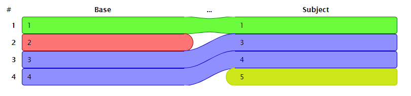

# diffter

[](https://travis-ci.org/szikszail/diffter) [](https://david-dm.org/szikszail/diffter) [](https://david-dm.org/szikszail/diffter#info=devDependencies) [](https://coveralls.io/github/szikszail/diffter?branch=master)

**diffter** can be used to determine the difference between two list of any items and generate an HTML report about the results.

## Prerequisites

* NodeJS 6+

## Usage

The following script generated the report can be seen below:

```javascript
const {diff, saveReport} = require('diffter');

const baseList = [1, 2, 3, 4];
const subjectList = [1, 3, 4, 5];

const results = diff(baseList, subjectList);
saveReport('./report', results);
```



The items are colored in the following way:

* **Green** items are the **same** in both list.
* **Blue** items are **changed position** in subject list.
* **Red** items in base list are those which are **deleted** in subject list.
* **Yellow** items in subject list are those which are **new** compared to the base list.
* **Gray** items are the **ignored** items.

## API

### `diff(baseList, subjectList[, options])`

**Params**:
* `{SourceList|Array} baseList` - the list of items used as the base list
* `{SourceList|Array} subjectList` - the list of subject items which are compared to the base list
* `{DiffOptions} options` - options could be passed to the analyzer.

**Returns**: `{DiffResults}` the results of the analysis

## Types

### `SourceList`

Type of a list as input for given methods.

* `{string} title` - the title/name of the list
* `{Array} items` - the actual items of the list

### `DiffResults`

TBD

### `DiffList`

TBD

### `DiffListItem`

TBD

### `DiffOptions`

Type to define options of diff-analysis.

* `{Comparator} comparator` - the comparator function, by default: [deep-eql](https://www.npmjs.com/package/deep-eql)
* `{Filter} filter` - the filter funtion, by default: `() => true`
* `{Transform} transform` - the transform function, by default: `item => item`

### `Comparator`

Type for comparator function, to compare to items in the diff-analyzer.

**Params**:
* `{*} base` - the base item
* `{*} subject` - the subject item
**Returns**: `{boolean}` - `true` if the two items are equal

### `Filter`

Type for filter function, to determine items to ignore.

**Params**:
* `{*} item` - the item to check
**Returns**: `{boolean}` - `true` if the item should be kept

### `Transform`

Tyoe for transform function, to convert given items to `DiffListItem`.

**Params**:
* `{*} item` - the item to transform
**Returns**: `{DiffListItem}` - the transformed item